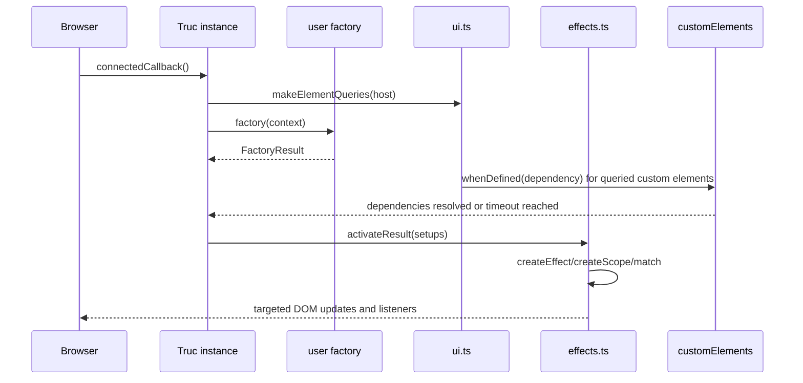

Le Truc is deliberately small: nearly all library-specific behavior lives in the modules under `src/`, while low-level signal primitives come from `@zeix/cause-effect`. The internal architecture is easiest to understand as a pipeline from custom element connection to deferred effect activation.

```mermaid
graph TD
  A[defineComponent in src/component.ts] --> B[makeElementQueries in src/ui.ts]
  A --> C[FactoryContext helpers]
  C --> D[watch/pass in src/effects.ts]
  C --> E[on in src/events.ts]
  C --> F[provideContexts/requestContext in src/context.ts]
  D --> G[@zeix/cause-effect signals and scopes]
  E --> G
  F --> G
  D --> H[DOM binders in src/helpers.ts]
  H --> I[safety.ts and scheduler.ts]
  B --> J[Dependency resolution for undefined custom elements]
  J --> G
```

## Module Responsibilities

- `src/component.ts` is the orchestration layer. `defineComponent()` validates the custom element name, creates the element class, builds the factory context on first connection, and activates effects inside a root scope.
- `src/ui.ts` owns DOM queries. `first()` and `all()` query against the host or shadow root, infer element types from selectors, and collect unresolved child custom elements so activation can wait for `customElements.whenDefined()`.
- `src/effects.ts` converts declarative helper calls into deferred `EffectDescriptor` functions. `watch()` resolves sources into signals, `pass()` swaps slot-backed child properties, and `each()` creates per-element subscopes for dynamic collections.
- `src/events.ts` attaches listeners with batching and requestAnimationFrame throttling. It uses event delegation for bubbling events on `Memo<Element[]>` targets and falls back to per-element listeners for non-bubbling events such as `focus`.
- `src/context.ts` implements the Web Components context-request proposal with a typed wrapper. Providers answer `ContextRequestEvent`s from descendants; consumers turn the response into a reactive `Memo`.
- `src/helpers.ts`, `src/safety.ts`, and `src/scheduler.ts` are the DOM mutation layer. They expose concise binders such as `bindText()` and `bindAttribute()` while centralizing XSS-sensitive behavior and RAF deduplication.

## Connection and Activation Lifecycle



This lifecycle comes directly from [`src/component.ts`](../../../../le-truc/src/component.ts). The first `connectedCallback()` call creates `FactoryContext`, stores the returned setup array, and delays activation until `resolveDependencies()` from [`src/ui.ts`](../../../../le-truc/src/ui.ts) finishes. That decision matters because `pass()` and `watch()` may target descendant custom elements whose properties are only defined after those elements are registered.

## Key Design Decisions

### 1. Effects are deferred, not run during factory execution

The factory in `defineComponent()` returns a `FactoryResult`, not immediate side effects. `activateResult()` in [`src/effects.ts`](../../../../le-truc/src/effects.ts) later walks the nested array and executes each descriptor inside a `createScope()` call. This avoids a whole class of ordering bugs: the component can query the DOM, gather dependencies, and only then register effects once child elements are ready.

### 2. Reactive props live on the host element

`#setAccessor()` in [`src/component.ts`](../../../../le-truc/src/component.ts) defines host properties with getters backed by signals. If the source is mutable, it wraps the signal in a `Slot`, preserving a stable property location while still allowing `pass()` to replace the underlying source later. That is why child composition in Le Truc feels like assigning properties to ordinary elements, even though the value is reactive under the hood.

### 3. Query helpers are type-aware and lazily reactive

`createElementsMemo()` in [`src/ui.ts`](../../../../le-truc/src/ui.ts) creates a `Memo` backed by a `MutationObserver`. The observer is only attached when some effect starts watching the memo, which keeps idle components cheap. The type-level selector parsing in the same module means `first('button')` narrows to `HTMLButtonElement`, which is why examples rarely need manual casts.

### 4. Event handling favors the DOM’s native model

Le Truc does not invent a synthetic event layer. `makeOn()` in [`src/events.ts`](../../../../le-truc/src/events.ts) uses normal `addEventListener()` calls, applies `batch()` when a handler returns `{ prop: value }`, and opportunistically delegates bubbling events through the component root. That keeps the runtime close to browser semantics while still removing repetitive glue code.

### 5. Security-sensitive mutations are centralized

`bindAttribute()` routes string values through `safeSetAttribute()` unless the caller explicitly opts into unsafe behavior, and `dangerouslyBindInnerHTML()` is named to make the trade-off obvious. These choices, implemented in [`src/helpers.ts`](../../../../le-truc/src/helpers.ts) and [`src/safety.ts`](../../../../le-truc/src/safety.ts), reduce the chance that a convenient binder silently becomes an injection sink.

## Data Flow in Practice

For a typical component such as [`examples/basic/hello/basic-hello.ts`](../../../../le-truc/examples/basic/hello/basic-hello.ts), the data flow looks like this:

1. Server HTML already contains the input and output nodes.
2. `expose()` creates a host property, `name`, from the initial DOM state.
3. `on(input, 'input', ...)` listens for user interaction and returns `{ name: ... }`.
4. `makeOn()` batches that object into synchronous host property writes.
5. The underlying signal changes.
6. `watch('name', bindText(output))` re-runs and mutates only the `<output>` text node.

That is the core architecture of the library: typed host properties connect browser events to tiny DOM mutations without introducing a virtual DOM, server runtime, or framework scheduler of its own.
