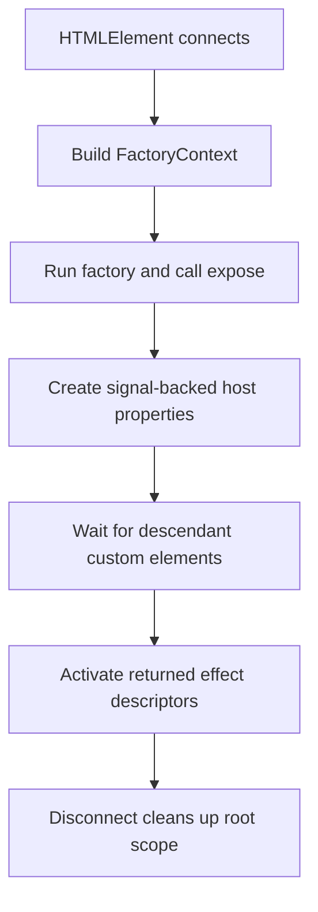

In Le Truc, a component is a standard custom element registered with `defineComponent()`. The key idea is that the markup already exists before the component runs. Your factory function queries that markup, declares typed reactive properties with `expose()`, and returns effect descriptors that synchronize state with the DOM.

## What This Concept Solves

Without a component boundary, interactive server-rendered HTML tends to accumulate free-floating selectors, global listeners, and hidden state. `defineComponent()` fixes that by giving each custom element:

- a local DOM query API through `first()` and `all()`,
- a typed host property surface,
- a root reactive scope tied to connection and disconnection,
- and a declarative list of event, watch, pass, and context effects.

This is the contract implemented in [`src/component.ts`](../../../../le-truc/src/component.ts).

## How It Relates to Other Concepts

- [Reactive Effects](/docs/reactive-effects) explains the descriptors your factory returns.
- [Composition](/docs/composition) covers how component properties can be passed to descendants or exposed as context.
- [Component API](/docs/api-reference/component-api) lists the full signatures for `defineComponent()`, `FactoryContext`, `Initializers`, and related types.

## How It Works Internally

`defineComponent()` does four important things in [`src/component.ts`](../../../../le-truc/src/component.ts):

1. It validates the element name and throws `InvalidComponentNameError` if the tag is not a lowercase custom element name.
2. On first connection, it creates query helpers with `makeElementQueries(this)`, then builds the `FactoryContext` with `watch`, `on`, `pass`, `provideContexts`, and `requestContext`.
3. It runs your factory once, stores the returned setup array, and waits for any queried descendant custom elements to be defined before activating those effects.
4. It installs host property accessors in `#setAccessor()`. Mutable sources become `Slot`s so they can later be replaced by `pass()`, while read-only signals and computed values become getter-only properties.



The private signal registry in [`src/internal.ts`](../../../../le-truc/src/internal.ts) stores those per-instance signals in a `WeakMap`. That keeps the public host API clean while giving helpers a shared place to resolve reactive properties by name.

## Basic Example

This is the minimal pattern used in the shipped hello example:

```ts
import { bindText, defineComponent } from '@zeix/le-truc'

type HelloProps = {
  name: string
}

defineComponent<HelloProps>('basic-hello', ({ expose, first, on, watch }) => {
  const input = first('input', 'Needed to edit the name.')
  const output = first('output', 'Needed to render the name.')

  expose({ name: output.textContent ?? 'World' })

  return [
    on(input, 'input', () => ({ name: input.value || 'World' })),
    watch('name', bindText(output)),
  ]
})
```

This pattern works well when the host property is derived from the initial DOM and later changed by user interaction.

## Advanced Example

`expose()` can initialize from parsers, signals, and branded methods. The parser branch is visible in [`examples/basic/number/basic-number.ts`](../../../../le-truc/examples/basic/number/basic-number.ts), where `asNumber()` reads an attribute and `watch(() => formatter.format(host.value), bindText(host))` derives display text from the reactive property:

```ts
import {
  asNumber,
  bindText,
  defineComponent,
  defineMethod,
} from '@zeix/le-truc'

type CounterProps = {
  value: number
  increment: () => void
}

defineComponent<CounterProps>('advanced-counter', ({ expose, host, first, on, watch }) => {
  const button = first('button', 'Needed to trigger increments.')
  const output = first('output', 'Needed to render the value.')

  expose({
    value: asNumber(0),
    increment: defineMethod(() => {
      host.value += 1
    }),
  })

  return [
    on(button, 'click', () => {
      host.increment()
    }),
    watch('value', bindText(output)),
  ]
})
```

Here `increment` is attached directly as a method, while `value` becomes a signal-backed property. That distinction matters because methods are not reactive sources on their own; they are imperative entry points into reactive state.

<Callout type="warn">Call `expose()` before relying on a property in `watch()` or `pass()`. If you forget to expose a prop, the host will not have the signal-backed accessor that helpers resolve through `getSignals()`, and you will end up reading a plain missing property instead of reactive state.</Callout>

<Accordions>
<Accordion title="Why Le Truc uses host properties instead of a separate component state object">
Putting state directly on the host element keeps integration predictable for anyone already comfortable with Custom Elements. A server-rendered page, another widget, or even plain imperative code can read `host.count` without learning a framework-specific store API. Internally this is still reactive because `#setAccessor()` installs getters or `Slot` descriptors, but externally it looks like a normal property contract. The trade-off is that property names must avoid collisions with `HTMLElement` members, which is why the library defines `ComponentProp` and reserved words in `src/component.ts`.
</Accordion>
<Accordion title="Why the factory returns descriptors instead of mutating the DOM immediately">
The delayed activation model solves dependency timing and cleanup in one step. Your factory can query descendants, collect setup functions, and return them as data; Le Truc then activates them inside a managed root scope after unresolved child custom elements have a chance to register. If effect creation happened eagerly, `pass()` could run before a descendant property existed or event listeners could attach before the right subtree was present. The descriptor model also lets you use falsy guards and nested arrays for conditional composition without additional API surface.
</Accordion>
</Accordions>
