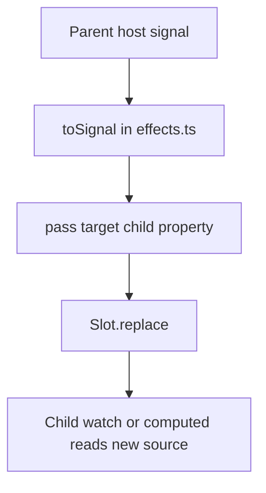

Le Truc supports two distinct composition patterns: direct property wiring through `pass()` and ambient dependency sharing through typed context. Both exist because component trees have two different problems to solve. Sometimes a parent owns a specific child input and should wire it directly. Sometimes a descendant several layers down needs a value such as theme, viewport, or locale without prop drilling through unrelated elements.

## What This Concept Solves

- `pass()` lets a parent replace a descendant Le Truc component’s slot-backed property with one of its own reactive sources.
- `provideContexts()` lets a provider expose selected host properties by name.
- `requestContext()` lets consumers turn a matching provider value into a reactive `Memo`.

These mechanisms are implemented in [`src/effects.ts`](../../../../le-truc/src/effects.ts) and [`src/context.ts`](../../../../le-truc/src/context.ts).

## How It Relates to Other Concepts

- [Components](/docs/components) explains why host properties are signal-backed and therefore passable.
- [Reactive Effects](/docs/reactive-effects) explains why both `pass()` and `provideContexts()` are deferred effect descriptors.
- [Context API](/docs/api-reference/context-api) and [Effects API](/docs/api-reference/effects-api) cover signatures and exported types.

## How `pass()` Works Internally

`pass()` depends on the slot behavior created in `#setAccessor()` inside [`src/component.ts`](../../../../le-truc/src/component.ts). If a child property is backed by a mutable signal, Le Truc wraps it in a `Slot`. Later, `makePass()` in [`src/effects.ts`](../../../../le-truc/src/effects.ts) resolves the parent source with `toSignal()`, calls `slot.replace(signal)`, and records a cleanup that restores the original backing signal when the parent scope is disposed.

That makes the child property look stable from the outside while still letting the parent substitute the backing state source.



## How Context Works Internally

`ContextRequestEvent` in [`src/context.ts`](../../../../le-truc/src/context.ts) wraps the Web Components community protocol. A provider effect listens for `context-request`, checks whether the request key matches one of the exported properties, stops propagation, and passes back a getter such as `() => host['media-theme']`. A consumer dispatches the event from its own host, captures the getter if any provider responds, and wraps that getter in `createMemo()`. Because the getter closes over the provider host property, the consumer reads a current reactive value every time the memo runs.

## Basic Example: Passing a Parent Property to Children

This pattern is used directly in [`examples/test/pass/test-pass.ts`](../../../../le-truc/examples/test/pass/test-pass.ts):

```ts
import { defineComponent } from '@zeix/le-truc'

type ParentProps = {
  count: number
}

defineComponent<ParentProps>('count-provider', ({ expose, first, all, pass }) => {
  const single = first('basic-number#single', 'Add a single target.')
  const group = all('basic-number.group')

  expose({ count: 0 })

  return [
    pass(single, { value: 'count' }),
    pass(group, { value: 'count' }),
  ]
})
```

Every target `basic-number` instance keeps its own rendering logic, but its `value` property is now backed by the parent’s `count` signal.

## Advanced Example: Responsive Context Provider

The example in [`examples/context/media/context-media.ts`](../../../../le-truc/examples/context/media/context-media.ts) exports several typed context keys and provides them from sensors tied to `matchMedia()`:

```ts
import { type Context, createSensor, defineComponent } from '@zeix/le-truc'

export const MEDIA_THEME = 'media-theme' as Context<'media-theme', () => 'light' | 'dark'>

type MediaProps = {
  readonly 'media-theme': 'light' | 'dark'
}

defineComponent<MediaProps>('context-media', ({ expose, provideContexts }) => {
  expose({
    [MEDIA_THEME]: createSensor<'light' | 'dark'>(set => {
      const mql = matchMedia('(prefers-color-scheme: dark)')
      const listener = (e: MediaQueryListEvent) => set(e.matches ? 'dark' : 'light')
      mql.addEventListener('change', listener)
      return () => mql.removeEventListener('change', listener)
    }, {
      value: matchMedia('(prefers-color-scheme: dark)').matches ? 'dark' : 'light',
    }),
  })

  return [provideContexts([MEDIA_THEME])]
})
```

A consumer can then use:

```ts
import { bindText, defineComponent } from '@zeix/le-truc'
import { MEDIA_THEME } from './context-media'

type ConsumerProps = {
  theme: 'light' | 'dark'
}

defineComponent<ConsumerProps>('theme-label', ({ expose, first, requestContext, watch }) => {
  const output = first('.theme', 'Needed to display the theme.')

  expose({
    theme: requestContext(MEDIA_THEME, 'light'),
  })

  return [watch('theme', bindText(output))]
})
```

<Callout type="warn">`pass()` only works reliably with descendant Le Truc components whose target properties are slot-backed. If you try to pass into a plain custom element or a property that was never exposed as mutable reactive state, `makePass()` will either throw `InvalidCustomElementError` or log a development warning that the property is not Slot-backed.</Callout>

<Accordions>
<Accordion title="When to choose pass over context">
Use `pass()` when a parent explicitly owns the contract of one or more descendant inputs. It is ideal for parent-to-child data flow such as pushing a selected value, pagination state, or shared filter text into concrete widgets the parent already queries. Because the source and targets are explicit, debugging is straightforward and TypeScript can enforce property names on both sides. The trade-off is that intermediate structure matters; if the target moves outside the queried subtree or is not a Le Truc component, the linkage disappears.
</Accordion>
<Accordion title="When to choose context over pass">
Use context when the value is ambient and cross-cutting rather than part of a narrow parent-child API. Theme, media preferences, locale, or editor state often fit better as context because any nested consumer can opt in without threading props through unrelated components. The implementation in `src/context.ts` is also aligned with the Web Components context-request proposal, so the pattern is easy to reason about if you already know the platform conventions. The trade-off is discoverability: because consumers depend on a provider elsewhere in the tree, the linkage is less obvious than a direct `pass()` call and deserves clear naming for context keys.
</Accordion>
</Accordions>
