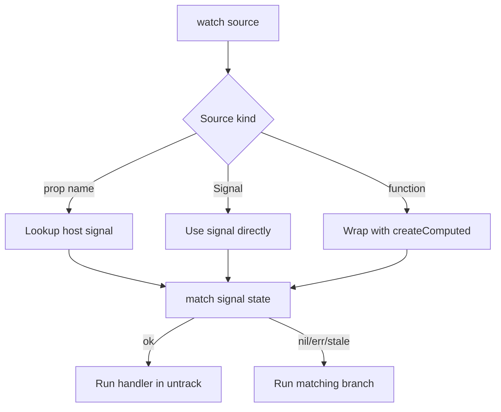

Reactive effects are the real execution layer of Le Truc. Your component factory does not directly create subscriptions or listeners; instead it returns `EffectDescriptor` functions. Those descriptors are activated later, inside a managed reactive scope, after the component has finished querying its DOM and resolving child dependencies.

## What This Concept Solves

The effect system exists to make server-rendered enhancement predictable:

- `watch()` keeps DOM mutations tied to explicit reactive sources.
- `on()` turns browser events into batched host property updates.
- `each()` gives dynamic element collections their own lifecycle.
- `pass()` swaps descendant reactive inputs without losing subscriptions.

All of that lives in [`src/effects.ts`](../../../../le-truc/src/effects.ts) and [`src/events.ts`](../../../../le-truc/src/events.ts).

## Relationship to Other Concepts

- [Components](/docs/components) covers where effect descriptors come from.
- [Composition](/docs/composition) explains the slot and context behaviors used by `pass()` and `requestContext()`.
- [Effects API](/docs/api-reference/effects-api) and [Events API](/docs/api-reference/events-api) document the helper types and overloads in detail.

## Internal Mechanics

`activateResult()` in [`src/effects.ts`](../../../../le-truc/src/effects.ts) recursively walks the nested `FactoryResult` array. It ignores falsy entries, which is what makes patterns like `condition && watch(...)` valid. Each descriptor then creates actual signal subscriptions through `createEffect()` and `match()` from `@zeix/cause-effect`.

The most important helper underneath `watch()` is `toSignal()`. It accepts three categories of source:

- a host property name like `'count'`,
- an explicit signal such as `createState(0)`,
- or a derivation function like `() => formatter.format(host.value)`.

When the source is a string, `toSignal()` first checks the internal signal map for a host prop and falls back to a memo that reads the host property directly. When the source is a function, it wraps it in `createComputed()` so dependencies are tracked during the pure phase rather than inside the side-effectful handler.



`on()` in [`src/events.ts`](../../../../le-truc/src/events.ts) follows a similar split. For single elements, it attaches a normal listener. For `Memo<Element[]>` targets, it prefers delegation from the host or shadow root when the event bubbles. For non-bubbling events like `focus`, it warns in development and creates per-element listeners instead. High-frequency passive events are automatically wrapped in `throttle()` from [`src/scheduler.ts`](../../../../le-truc/src/scheduler.ts).

## Basic Example

```ts
import { bindText, defineComponent } from '@zeix/le-truc'

type CounterProps = {
  count: number
}

defineComponent<CounterProps>('basic-counter', ({ expose, first, host, on, watch }) => {
  const button = first('button', 'Add a button.')
  const output = first('span', 'Add a span.')

  expose({ count: Number.parseInt(output.textContent || '0', 10) })

  return [
    on(button, 'click', () => ({ count: host.count + 1 })),
    watch('count', bindText(output)),
  ]
})
```

This is the smallest complete effect loop: one event source writes to one reactive property, and one watcher mirrors it to the DOM.

## Advanced Example

Dynamic collections are where `each()` matters. The test fixture in [`examples/test/each/test-each.ts`](../../../../le-truc/examples/test/each/test-each.ts) creates per-`<li>` effects so each item gets its own selection watcher and click listener:

```ts
import { defineComponent, each } from '@zeix/le-truc'

type ListProps = {
  selected: number
}

defineComponent<ListProps>('selectable-list', ({ expose, all, on, watch }) => {
  const items = all('li')

  expose({ selected: -1 })

  return [
    each(items, item => {
      const index = Number(item.dataset.index ?? -1)

      return [
        watch('selected', selected => {
          item.classList.toggle('active', selected === index)
        }),
        on(item, 'click', () => ({ selected: index })),
      ]
    }),
  ]
})
```

Because `each()` creates a scope per element, listeners and watchers for removed elements are automatically disposed when the memo’s contents change.

<Callout type="warn">Do not perform async state transitions by returning a `Promise` from `on()` and expecting the resolved value to update host properties. `OnEventHandler` only applies synchronous object returns. For async work, trigger a signal in `on()` and derive a `Task` or `createComputed()` value that `watch()` can observe.</Callout>

<Accordions>
<Accordion title="Explicit sources versus automatic dependency tracking">
Le Truc intentionally makes `watch()` source-driven instead of silently tracking every read inside the handler. That design keeps side effects stable: a watcher on `'count'` will only rerun when `count` changes, not when some unrelated value happens to be read during a logging statement or DOM lookup. The trade-off is that you sometimes need to move derivation logic into a function source such as `watch(() => formatter.format(host.value), bindText(output))`. In practice that is a good thing because the reactive boundary becomes visible in code and easier to review.
</Accordion>
<Accordion title="Delegation versus per-element listeners">
For bubbling events on collections, delegation is cheaper because `makeOn()` installs a single listener on the host or shadow root and matches the event path against current memo members. That reduces listener churn when the DOM changes and pairs naturally with `all()` selectors. The trade-off is that events like `focus`, `blur`, and `mouseenter` do not bubble, so delegation cannot model them correctly. In those cases Le Truc falls back to per-element listeners, and the docs examples use `each()` when the intent should remain explicit.
</Accordion>
</Accordions>
